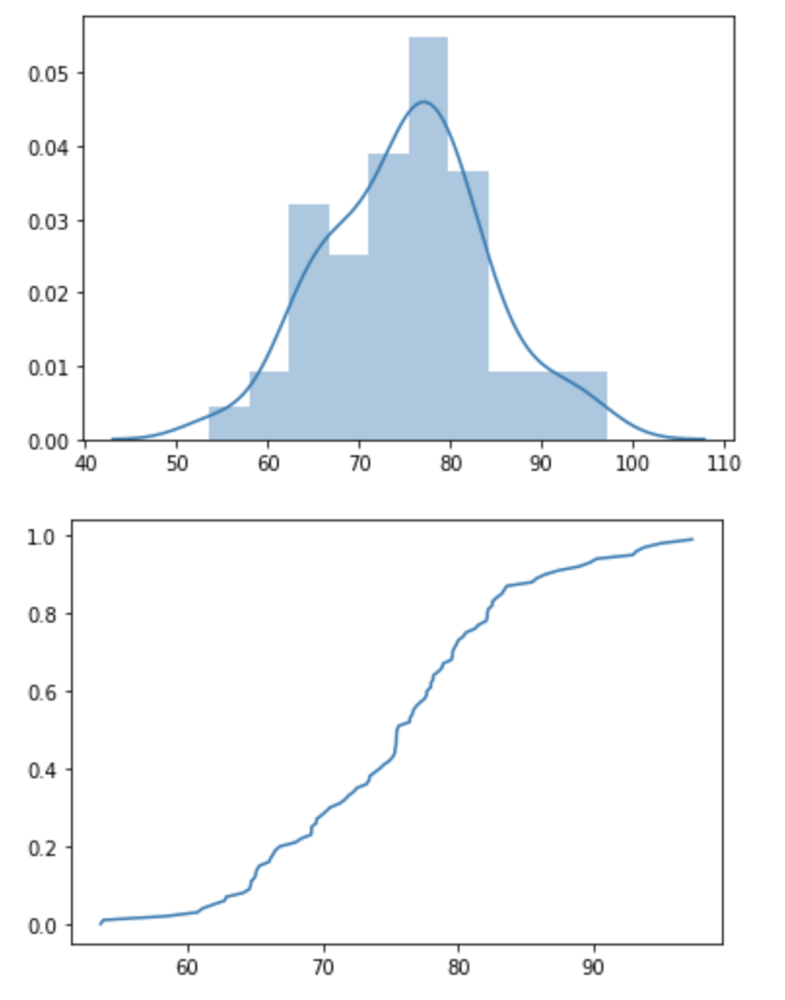

# Chapter-3
## Exercise-1
从正态分布N(100,100)中随机产生1000个随机数。
### 1.1
作出这1000个正态随机数的直方图
代码：
``` Python
import numpy as np
from matplotlib import pyplot as plt

mu ,sigma = 100, 10
sampleNo = 1000
s = np.random.normal(mu, sigma, sampleNo)
fig = plt.figure()  
ax1 = fig.add_subplot()
ax1.hist(s,bins=100)
plt.show()
```
运行：


### 1.2
从这1000个随机数中随机有放回地抽取500个，作出其直方图。
代码：
``` Python
import numpy as np
from matplotlib import pyplot as plt

mu ,sigma = 100, 10
sampleNo = 1000
s = np.random.normal(mu, sigma, sampleNo)

# 随机有放回的抽样，500
s = np.random.choice(a=s,size=500,replace=True)

fig = plt.figure()  
ax1 = fig.add_subplot()
ax1.hist(s,bins=100)
plt.show()
```
运行：


### 1.3
比较它们的样本均值与样本方差。
``` Python
import numpy as np

mu ,sigma = 100, 10
sampleNo = 1000
s = np.random.normal(mu, sigma, sampleNo)

print("随机有放回抽样前")
print(np.mean(s))
print(np.var(s))

print("随机有放回抽样后")
# 随机有放回的抽样，500
s = np.random.choice(a=s,size=500,replace=True)
print(np.mean(s))
print(np.var(s))
```
运行：
``` Code
随机有放回抽样前
99.72563508617185
103.70279319719799
随机有放回抽样后
99.91320903343082
89.70336459956461
```

## Exercise-2
假定某校100名女生的血清总蛋白含量(g/L)服从均值为75, 标准差为9,并假定数据由下面的命令产生
```
> options(digits=4)
> rnorm(100,75,9)
```
根据产生的数据
### 2.1
``` Python
import numpy as np
import pandas as pd

mu ,sigma = 75, 9
sampleNo = 100
np.random.seed(4)
s = np.random.normal(mu, sigma, sampleNo)
s = pd.Series(s)

des = s.describe()

print('均值' + ' ' *3 + str(s.mean()))
print('方差' + ' ' *3 + str(s.mean()  ** 2))
print('标准差' + ' ' * 3 + str(s.std()))
print('极差' + ' ' * 3 + str(des.loc['max'] - des.loc['min']))
print('四分位极差' + ' ' * 3 + str(des.loc['75%'] - des.loc['25%']))
print('变异系数' + ' ' * 3 + str(des.loc['std']/des.loc['mean']))
print('峰度' + ' ' * 3 + str(s.kurt()))
print('偏度' + ' ' * 3 + str(s.skew()))
```
运行：
``` Code
均值   75.31746220176495
方差   5672.720112514293
标准差   8.800334602163229
极差   43.70723491893173
四分位极差   11.261330048192207
变异系数   0.11684321729519195
峰度   0.044052881094148066
偏度   0.041751365394366455
```

### 2.2
画出直方图、核密度估计曲线、QQ图
代码：
``` Python
from matplotlib import pyplot as plt
import seaborn as sns
import numpy as np

mu ,sigma = 75, 9
sampleNo = 100
np.random.seed(4)
s = np.random.normal(mu, sigma, sampleNo)

sns.distplot(s)

plt.show()

sorted_ = np.sort(s)
y = np.arange(len(sorted_))/float(len(sorted_))
plt.plot(sorted_, y)
plt.show()
```
运行：


### 2.3
画出茎叶图、盒形图
代码：
``` Python
from matplotlib import pyplot as plt
import numpy as np

mu ,sigma = 75, 9
sampleNo = 100
np.random.seed(4)
s = np.random.normal(mu, sigma, sampleNo)
x = np.arange(0,s.size,1)

plt.stem(x,s)
plt.show()

plt.boxplot(x)
plt.show()
```
运行：


## Exercise-3
考虑美国从1947年第1季度到2011年第3季度的季度实际GNP，该数据存放于文件q-GNPC96.txt中，数据已做了季节调整，以2005年GDP为基础进行了通胀调整，以10亿美元为单位。假设x_t代表GNP增长率的时间序列数据。
### 3.1
通过ar命令，应用AIC准则，可以为x_t识别一个几阶AR()模型？拟合这个模型，拟合的模型充分吗？为什么？
代码：
``` Python
import statsmodels.api as sm
import pandas as pd
from statsmodels.tsa.arima_model import ARIMA

dt = pd.read_csv('q-GNPC96.txt',delim_whitespace = True)
print(dt)

order = sm.tsa.arma_order_select_ic(dt['gnp'].values,max_ar=6,max_ma=4,ic='aic')['aic_min_order']

print(order)

model = ARIMA(dt['gnp'].values, order=(5,1,2))
model_fit = model.fit(disp=0)
print(model_fit.resid)
print(sm.stats.durbin_watson(model_fit.resid))
```
运行：
```

     year  mon  day      gnp
0    1947    1    1   1780.4
1    1947    4    1   1778.1
2    1947    7    1   1776.6
3    1947   10    1   1804.0
4    1948    1    1   1833.4
..    ...  ...  ...      ...
254  2010    7    1  13328.9
255  2010   10    1  13383.9
256  2011    1    1  13432.2
257  2011    4    1  13504.2
258  2011    7    1  13567.9

[259 rows x 4 columns]
(5, 2)
1.9743491171586955
```
解释：
拟合较为充分。

### 3.2
数据x_t的样本PACF识别的是几阶AR()时间序列模型？拟合这个模型，拟合的模型充分吗？ 为什么？
代码：
``` Python
from statsmodels.graphics.tsaplots import *
import matplotlib.pyplot as plt
import pandas as pd

dt = pd.read_csv('q-GNPC96.txt',delim_whitespace = True)
print(dt)
# 将画面一分为二
# 第一个画自相关图
# 第二个画偏自相关图
# 将画面一分为二
axe1=plt.subplot(121)
axe2=plt.subplot(122)
#在第一个画面中画出序列的自相关系数图
plot1=plot_acf(dt['gnp'].values,lags=30,ax=axe1)
#在第二个画面中画出序列的偏自相关系数图
plot2=plot_pacf(dt['gnp'].values,lags=30,ax=axe2)
```
运行：
``` Code
     year  mon  day      gnp
0    1947    1    1   1780.4
1    1947    4    1   1778.1
2    1947    7    1   1776.6
3    1947   10    1   1804.0
4    1948    1    1   1833.4
..    ...  ...  ...      ...
254  2010    7    1  13328.9
255  2010   10    1  13383.9
256  2011    1    1  13432.2
257  2011    4    1  13504.2
258  2011    7    1  13567.9

[259 rows x 4 columns]
1.9605459114648938
```

解释：
拟合较为充分。


## Exercise-4
以 NYSE/AMEX/NASDAQ 的市场资本为基础考虑 CRSP Decile 1、2、5、9、10投资组合的月简单收益率. 该数据的时间区间是从1961年1月到2011年9月.
### 4.1
代码：
``` Python
import pandas as pd
import statsmodels.tsa.api as smt

dt = pd.read_csv('m-dec125910-6111.txt',delim_whitespace = True)

print('dec2')
acf,confint = smt.stattools.acf(dt['dec2'].values,nlags=12,alpha=0.05)
print(acf)
print(confint)

print('dec10')
acf,confint = smt.stattools.acf(dt['dec10'].values,nlags=12,alpha=0.05)
print(acf)
print(confint)
```
运行：
``` Code
dec2
[ 1.00000000e+00  1.14381232e-01 -5.35295156e-02  4.22201333e-04
  3.32119592e-02  3.54196271e-02 -6.35817101e-02 -8.84216206e-03
 -6.27358745e-02 -3.52485985e-02  6.98192857e-03 -7.13094850e-03
  1.54844240e-02]
[[ 1.          1.        ]
 [ 0.03495948  0.19380298]
 [-0.13398363  0.0269246 ]
 [-0.08025626  0.08110066]
 [-0.04746652  0.11389043]
 [-0.04534504  0.1161843 ]
 [-0.1444443   0.01728088]
 [-0.09001949  0.07233517]
 [-0.14391928  0.01844753]
 [-0.11673724  0.04624004]
 [-0.07460283  0.08856668]
 [-0.08871947  0.07445758]
 [-0.06610803  0.09707688]]
dec10
[ 1.          0.21933792 -0.00539058 -0.01418971 -0.00417032 -0.01545752
 -0.04041862 -0.02533684 -0.06571663 -0.04001759  0.00737603  0.04865837
  0.13519253]
[[ 1.          1.        ]
 [ 0.13991618  0.29875967]
 [-0.0885455   0.07776434]
 [-0.09734684  0.06896741]
 [-0.08734271  0.07900208]
 [-0.09863123  0.0677162 ]
 [-0.12361045  0.04277322]
 [-0.10865245  0.05797877]
 [-0.14908083  0.01764757]
 [-0.12370793  0.04367275]
 [-0.07643492  0.09118698]
 [-0.03515667  0.13247342]
 [ 0.05119949  0.21918557]]
```
解释：
在5%的显著性水平下检验，滞后阶数为1-12的自相关系数不全都为0。即原假设不成立。

### 4.2
对于 Decile 2 的收益率序列建立一个 ARMA 模型, 对模型进行检验并写出拟合的模型。
代码：
``` Python
import pandas as pd
import statsmodels.api as sm

dt = pd.read_csv('m-dec125910-6111.txt',delim_whitespace = True)

print(sm.tsa.arma_order_select_ic(dt['dec2'].values,max_ar=6,max_ma=4,ic='aic')['aic_min_order'])
```
运行：
```
(0, 1)
```
解释：
**模型是ARMA(0,1)**